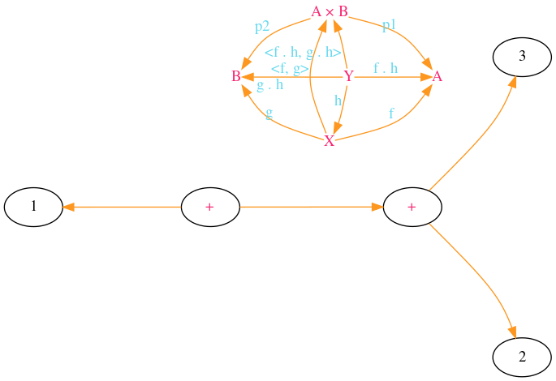

# gvs

GraphViz Extension Language for Scheme

Original [file](ctp.gvs):

```scm
(digraph
  C
  (settings
    (graph (layout sfdp) (rankdir TB) (bgcolor "#00000000") (splines curved))
    (edge (fontcolor "#66D9EF") (color "#FD971F"))
    (node (fontcolor "#F92672") (shape plain)))

  (nodes "A × B" A B X Y)

  (-> X A       (label f))
  (-> X "A × B" (label "<f, g>"))
  (-> X B       (label g))
  (-> "A × B" A (label p1))
  (-> "A × B" B (label p2))
  (-> Y A       (label "f . h"))
  (-> Y X       (label h))
  (-> Y B       (label "g . h"))
  (-> Y "A × B" (label "<f . h, g . h>"))

  (settings (node (shape))) ; (shape) resets it to default

  (node a (label "+"))
  (node b (label "+"))

  (-> a 1)
  (-> a b)
  (-> b 2)
  (-> b 3))
```

Resulting [file](ctp.gv) (obtained with `gvs2gv ctp.gvs`):

```gv
digraph C
{
	graph [ layout=sfdp rankdir=TB bgcolor="#00000000" splines=curved ];
	"A × B" [ fontcolor="#F92672" shape=plain ];
	A [ fontcolor="#F92672" shape=plain ];
	B [ fontcolor="#F92672" shape=plain ];
	X [ fontcolor="#F92672" shape=plain ];
	Y [ fontcolor="#F92672" shape=plain ];
	X -> A [ fontcolor="#66D9EF" color="#FD971F" label=f ];
	X -> "A × B" [ fontcolor="#66D9EF" color="#FD971F" label="<f, g>" ];
	X -> B [ fontcolor="#66D9EF" color="#FD971F" label=g ];
	"A × B" -> A [ fontcolor="#66D9EF" color="#FD971F" label=p1 ];
	"A × B" -> B [ fontcolor="#66D9EF" color="#FD971F" label=p2 ];
	Y -> A [ fontcolor="#66D9EF" color="#FD971F" label="f . h" ];
	Y -> X [ fontcolor="#66D9EF" color="#FD971F" label=h ];
	Y -> B [ fontcolor="#66D9EF" color="#FD971F" label="g . h" ];
	Y -> "A × B" [ fontcolor="#66D9EF" color="#FD971F" label="<f . h, g . h>" ];
	a [ fontcolor="#F92672" label="+" ];
	b [ fontcolor="#F92672" label="+" ];
	a -> 1 [ fontcolor="#66D9EF" color="#FD971F" ];
	a -> b [ fontcolor="#66D9EF" color="#FD971F" ];
	b -> 2 [ fontcolor="#66D9EF" color="#FD971F" ];
	b -> 3 [ fontcolor="#66D9EF" color="#FD971F" ];
}
```

Resulting image (`dot -Tpng -o ctp.png ctp.gv`):


